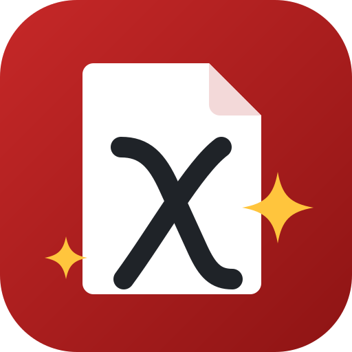

<p align="center"></p>

# PaperReady

A web app that gets your paper ready to submit. It has two modes, picked at
the top of the page:

- **🧹 Prepare for arXiv:** upload your LaTeX project as a `.zip` and get back
  a cleaned, submission-ready `.zip`.
- **📏 Check ACL format:** upload the camera-ready PDF of an ACL-style paper and
  check it with [aclpubcheck](https://github.com/acl-org/aclpubcheck), the tool
  ACL publication chairs use (see [Check ACL format](#check-acl-format)).

For arXiv, the cleaning itself is done by Google's
[`arxiv_latex_cleaner`](https://github.com/google-research/arxiv-latex-cleaner).
It strips comments, `\iffalse` blocks and helper commands like `\todo{}`, and
removes files your paper doesn't use. PaperReady handles everything around it:
messy real-world zips, the missing bibliography, and checking that the result
will actually build on arXiv.

## Prepare for arXiv

1. Zip your LaTeX project. On Overleaf, **Menu → Download → Source** gives you
   exactly this zip.
2. Open the app, drop the `.zip` in and click **Clean my paper**.
3. Check the readiness checklist, then download the cleaned `.zip` and upload
   it to arXiv.

Nothing is stored: each upload is processed in a temporary folder that is
deleted right away.

## What it does for you

**Finds your paper in any zip**
- The main file is found anywhere in the upload, even several folders deep.
  `main.tex` is preferred; otherwise any file with `\documentclass` and
  `\begin{document}`.
- If the zip holds several papers or an unusual layout, type the main file
  or its folder in **Main .tex file or folder**: `paper.tex`, `src/paper.tex`
  or `my-paper`.
- Leftover `*_arXiv` folders from an earlier run are ignored.

**Copes with real-world zips**
- Zips from macOS Finder, Windows Explorer, 7-Zip, the `zip` command and
  Overleaf all work. `__MACOSX/`, `._*`, `.DS_Store` and `Thumbs.db` are
  removed first.
- Windows-style `\` paths and accented or CJK file names are read correctly.
- `.tex` files in Latin-1, Windows-1252 or other 8-bit encodings are cleaned,
  with their original bytes kept. UTF-16/UTF-32 files are converted to UTF-8.
- Encrypted, corrupted or oddly compressed zips get a clear message instead of
  a crash.

**Generates the missing bibliography**
- arXiv does not run BibTeX, and Overleaf's source download has no `.bbl`, so
  citations would show as "?".
- When your paper uses a `.bib` but the zip has no `.bbl`, the app runs BibTeX
  with your own `.bib` and `.bst` and adds `main.bbl`.
- Citations are read from the *cleaned* sources, so references that only
  appear in removed comments don't sneak in.
- Styles set inside a template's `.sty` are found too, as in the ACL template.
- An uploaded `.bbl` is always kept as is.

**Checks the result before you submit**
- **Missing files:** files referenced by `\input`, `\include` or
  `\includegraphics` that aren't in the zip are listed, with the file that
  references each one.
- **Dropped files:** files your paper still uses but `arxiv_latex_cleaner`
  left out are reported, with the reason and how to fix it. Common causes:
  figures other than png/jpg/pdf referenced without their extension, style
  files in subfolders, or names with special characters.
- **Review version:** warns when you're about to post the anonymous,
  line-numbered submission instead of the final version. It knows the ACL,
  NeurIPS, ICML, ICLR and CVPR/ICCV templates (e.g. `\usepackage[review]{acl}`,
  `\usepackage{neurips_2024}` without `[preprint]`, ICLR without
  `\iclrfinalcopy`) and `\linenumbers`, and names the one-line fix. It reads
  the cleaned sources, so commented-out switches don't count.
- **Other checks:** a missing `.bbl`, upper-case `.TEX` files (the cleaner
  skips them), and outputs over arXiv's 50 MB limit.

**Shows what happened**
- **Before/after numbers:** files, total size, and how much the main `.tex`
  shrank.
- **A readiness checklist:** main file, missing files, dropped files,
  bibliography, final version and size, each with ✅ or ⚠️.
- **A file list:** every kept and removed file, with its size.

**Stays faithful to `arxiv_latex_cleaner`**
- The app only prepares the input and adds `main.bbl` when it's missing.
- The cleaned files are byte-for-byte what `arxiv_latex_cleaner` produces
  from the same folder, and a test enforces this.

## Cleaning options

Every `arxiv_latex_cleaner` option is available under **⚙️ Cleaning options**,
with the tool's own defaults:

| Tab | Options |
|---|---|
| ✂️ Remove content | commands to delete (`todo`), commands to unwrap and keep their text (`hl`), environments to delete (`note`), `\if…` commands that aren't conditionals |
| 🖼️ Images | resize (max size), PNG → JPG (quality, size threshold), compress PDFs with Ghostscript (dpi), per-image size allowlist (JSON) |
| 🧩 Other | generate a missing `.bbl` with BibTeX (on by default), keep `.bib` files, externalized TikZ folder, Inkscape SVGs (`\includesvg`), a `cleaner_config.yaml` upload (e.g. `patterns_and_insertions`) |

Some notes on these options:
- **Paths:** folders and image paths are relative to the folder of your main
  `.tex`.
- **Validation:** invalid names, JSON or config files are reported before
  anything runs.
- **Config precedence:** options set in the UI take precedence over an
  uploaded config.
- **Config values that actually apply:** upstream's own `--config` handling
  overwrites single values such as `im_size` with its defaults. The app passes
  those values explicitly, so your config is applied.

## Check ACL format

Upload the camera-ready PDF, pick the paper type (long: 9 pages, short: 5,
demo: 7, or other) and click **Check my paper**. aclpubcheck checks:

- **Errors:** page size, text or images in the margins, the page limit for the
  main text, and the main font.
- **Warnings:** reference links (few ACL Anthology DOIs, too many arXiv links)
  and, optionally, outdated author names.

The app then shows:
- **The results by category,** with repeated messages merged (e.g. "Text on page
  4 bleeds into the left margin ×51").
- **Each flagged page,** with the problem areas marked in red.
- **A downloadable report** (Markdown).

It also recognises a **review version**, either from the "Anonymous …
submission" author line on the first page or from its line numbers, which show
up as hundreds of margin errors. The app says so instead of listing them all.

**Check options**, all passed to aclpubcheck:
- **Empty bottom margin:** checks that the bottom of each page is blank, because
  the proceedings put page numbers there. On by default.
- **Reference links:** runs locally. On by default; aclpubcheck's own command
  line never runs this check.
- **Author names online:** off by default, because it sends your references to
  the Scholarcy API and is slow.

## Which files arXiv needs

arXiv compiles from the folder that holds the main `.tex`. Here is what
`arxiv_latex_cleaner` does with each kind of file:

| File | What happens |
|---|---|
| `.tex` next to the main file | always kept, and cleaned |
| `.tex` in subfolders | kept only if `\input`/`\include`d, and cleaned |
| `.png` `.jpg` `.jpeg` `.pdf` figures | kept only if a kept `.tex` uses them |
| other files next to the main file (`.sty`, `.cls`, `.bst`, `.bbl`, …) | kept as they are |
| other files in subfolders (`.eps`, `.sty`, …) | kept only if referenced **with** their extension |
| `.aux`, `.log`, `.synctex.gz`, `.svg`, `.ps`, `.bib`, … | removed (`.bib` stays with **Keep .bib files**) |

For a paper that builds on arXiv, keep custom `.sty`/`.cls`/`.bst` files next
to the main file, and write the extension for `.eps` figures. The app warns you
when either rule bites.

## Run it locally

```bash
uv sync
uv run streamlit run streamlit_app.py
```

Then open the URL it prints (usually http://localhost:8501).

Two features use system tools. Without them the app still works, and it
tells you when one of them is needed:

| Feature | Needs | Debian/Ubuntu | macOS |
|---|---|---|---|
| Generate `.bbl` | BibTeX + standard styles | `apt install texlive-binaries texlive-base` | `brew install --cask mactex-no-gui` |
| Compress PDF figures | Ghostscript | `apt install ghostscript` | `brew install ghostscript` |

## Run the tests

```bash
uv run pytest
```

- **`tests/test_arxiv.py`** covers the whole pipeline: zip extraction, junk
  and encoding handling, main-file detection, reference checks, every cleaner
  option, `.bbl` generation, and byte-for-byte parity with
  `arxiv_latex_cleaner`.
- **`tests/test_streamlit_app.py`** drives the web UI with Streamlit's
  `AppTest`.
- **`tests/test_acl.py`** covers the ACL mode: grouping, review-version
  detection, error handling and real aclpubcheck runs.
- **Tests that need BibTeX or pdflatex** are skipped when those aren't
  installed.

## Deploy it live (free)

The app runs on **Streamlit Community Cloud**, which hosts it from this GitHub
repo and redeploys on every push to `main`:

1. Go to <https://share.streamlit.io> and sign in with GitHub.
2. **Create app** → pick this repo → set the main file to `streamlit_app.py`.
3. **Deploy.** You get a permanent `https://…streamlit.app` link to share.

Streamlit Cloud installs Python packages from `requirements.txt` and system
packages from `packages.txt` (Ghostscript and BibTeX). If a newly added system
package is missing after a deploy, reboot the app from the Streamlit Cloud
dashboard.

## Limitations

- **biblatex/Biber:** projects that use biblatex need the `.bbl` from your own
  build. On Overleaf it's under **Logs and output files → Other logs and
  files**.
- **Natbib styles:** styles such as `plainnat` are not part of the standard
  styles installed on the server. Include the `.bst` in your zip; templates
  like ACL, NeurIPS and ICML already ship theirs.
- **Unwrapping commands:** this only works for one-argument commands, because
  `arxiv_latex_cleaner` keeps the first argument. `\textcolor{red}{text}` would
  keep "red".
- **Final check:** always look at arXiv's PDF preview before submitting. It's
  the only check against arXiv's own TeX installation.

## Project layout

```
streamlit_app.py            the page: header, mode switch
views/arxiv_view.py         “Prepare for arXiv”: options, cleaning, results
views/acl_view.py           “Check ACL format”: options, check, report
paperready/core.py       shared upload handling (safe unzip, OS-junk removal)
paperready/arxiv.py      the arXiv pipeline (prepare → arxiv_latex_cleaner → checks → .bbl → zip)
paperready/acl.py        the ACL check (runs aclpubcheck, groups results, page images)
paperready/acl_runner.py runs aclpubcheck in a separate process
.streamlit/config.toml      the app's theme
assets/                     icons: PaperReady (icon.svg + PNGs), arXiv mode (arxiv.svg), ACL mode (acl.svg)
requirements.txt            Python dependencies for Streamlit Community Cloud
packages.txt                system packages for Streamlit Community Cloud (Ghostscript, BibTeX)
pyproject.toml              dependencies for local development with uv
tests/                      pytest suite (uv run pytest)
```
